# BinGo: Kumpulan Diagram Arsitektur dan Alur Sistem

Dokumen ini merangkum arsitektur MVP BinGo lima role dalam format Mermaid. Diagram disusun berdasarkan implementasi saat ini pada aplikasi Expo, API NestJS, Prisma, PostgreSQL/PostGIS, deployment Vercel dan Render, serta alur pengujian fungsional.

## Daftar Diagram

1. C4 Level 1: System Context
2. C4 Level 2: Container
3. C4 Level 3: Komponen Frontend
4. C4 Level 3: Komponen Backend
5. Deployment Production
6. Model Kewenangan dan Multi-tenancy
7. Entity Relationship Domain Pivot
8. Golden Path Ujung ke Ujung
9. Sequence Registrasi dan Verifikasi Organisasi
10. Sequence Layanan Warga dan Pembayaran
11. Sequence Rute Pengumpulan
12. Sequence NFC dan Sinkronisasi Offline
13. Sequence Penimbangan, Pemilahan, dan Inventory
14. Sequence Marketplace Material
15. Sequence Pelaporan Sampah Liar
16. State Organisasi
17. State Collection Run dan Route Stop
18. State Batch Timbang
19. State Lot dan Pesanan
20. Data Flow Dampak Terverifikasi
21. CI/CD dan Quality Gate

## 1. C4 Level 1: System Context

Diagram ini menunjukkan BinGo sebagai satu sistem dan pihak yang berinteraksi dengannya.

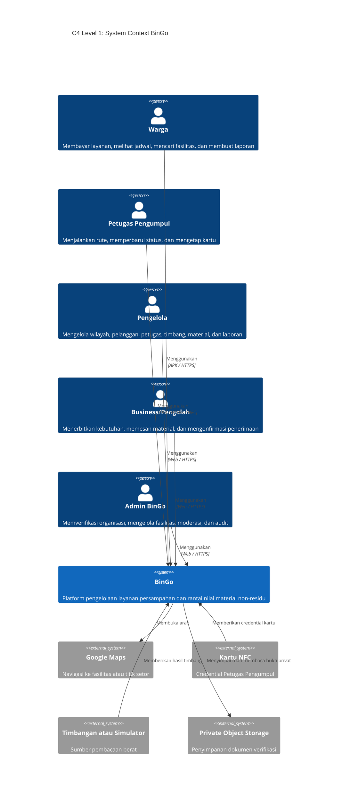
```mermaid
C4Context
    title C4 Level 1: System Context BinGo

    Person(household, "Warga", "Membayar layanan, melihat jadwal, mencari fasilitas, dan membuat laporan")
    Person(collector, "Petugas Pengumpul", "Menjalankan rute, memperbarui status, dan mengetap kartu")
    Person(manager, "Pengelola", "Mengelola wilayah, pelanggan, petugas, timbang, material, dan laporan")
    Person(business, "Business/Pengolah", "Menerbitkan kebutuhan, memesan material, dan mengonfirmasi penerimaan")
    Person(admin, "Admin BinGo", "Memverifikasi organisasi, mengelola fasilitas, moderasi, dan audit")

    System(bingo, "BinGo", "Platform pengelolaan layanan persampahan dan rantai nilai material non-residu")

    System_Ext(maps, "Google Maps", "Navigasi ke fasilitas atau titik setor")
    System_Ext(nfc, "Kartu NFC", "Credential Petugas Pengumpul")
    System_Ext(scale, "Timbangan atau Simulator", "Sumber pembacaan berat")
    System_Ext(storage, "Private Object Storage", "Penyimpanan dokumen verifikasi")

    Rel(household, bingo, "Menggunakan", "APK / HTTPS")
    Rel(collector, bingo, "Menggunakan", "APK / HTTPS / NFC")
    Rel(manager, bingo, "Menggunakan", "Web / HTTPS")
    Rel(business, bingo, "Menggunakan", "Web / HTTPS")
    Rel(admin, bingo, "Menggunakan", "Web / HTTPS")
    Rel(bingo, maps, "Membuka arah")
    Rel(nfc, bingo, "Memberikan credential kartu")
    Rel(scale, bingo, "Memberikan hasil timbang")
    Rel(bingo, storage, "Menyimpan dan membaca bukti privat")
```

## 2. C4 Level 2: Container

Satu codebase Expo menghasilkan pengalaman APK dan web yang berbeda secara responsif. Seluruh kanal memakai API dan database yang sama.

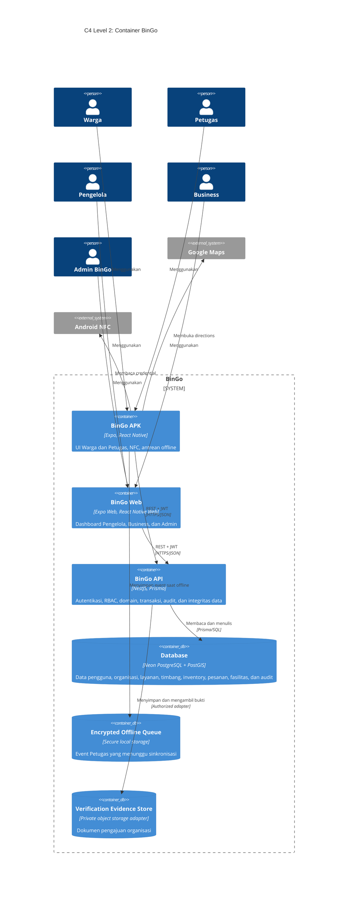
```mermaid
C4Container
    title C4 Level 2: Container BinGo

    Person(household, "Warga")
    Person(collector, "Petugas")
    Person(manager, "Pengelola")
    Person(business, "Business")
    Person(admin, "Admin BinGo")

    System_Boundary(bingo, "BinGo") {
        Container(apk, "BinGo APK", "Expo, React Native", "UI Warga dan Petugas, NFC, antrean offline")
        Container(web, "BinGo Web", "Expo Web, React Native Web", "Dashboard Pengelola, Business, dan Admin")
        Container(api, "BinGo API", "NestJS, Prisma", "Autentikasi, RBAC, domain, transaksi, audit, dan integritas data")
        ContainerDb(db, "Database", "Neon PostgreSQL + PostGIS", "Data pengguna, organisasi, layanan, timbang, inventory, pesanan, fasilitas, dan audit")
        ContainerDb(localQueue, "Encrypted Offline Queue", "Secure local storage", "Event Petugas yang menunggu sinkronisasi")
        ContainerDb(fileStore, "Verification Evidence Store", "Private object storage adapter", "Dokumen pengajuan organisasi")
    }

    System_Ext(maps, "Google Maps")
    System_Ext(nfc, "Android NFC")

    Rel(household, apk, "Menggunakan")
    Rel(collector, apk, "Menggunakan")
    Rel(manager, web, "Menggunakan")
    Rel(business, web, "Menggunakan")
    Rel(admin, web, "Menggunakan")
    Rel(apk, api, "REST + JWT", "HTTPS/JSON")
    Rel(web, api, "REST + JWT", "HTTPS/JSON")
    Rel(api, db, "Membaca dan menulis", "Prisma/SQL")
    Rel(api, fileStore, "Menyimpan dan mengambil bukti", "Authorized adapter")
    Rel(apk, localQueue, "Menyimpan event saat offline")
    Rel(apk, nfc, "Membaca credential")
    Rel(apk, maps, "Membuka directions")
```

## 3. C4 Level 3: Komponen Frontend

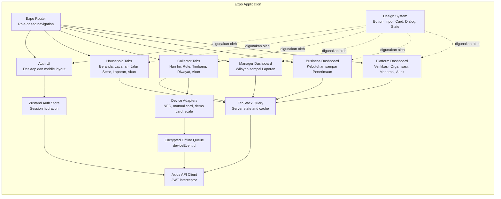
```mermaid
flowchart LR
    subgraph Frontend["Expo Application"]
        Router["Expo Router<br/>Role-based navigation"]
        AuthUI["Auth UI<br/>Desktop dan mobile layout"]
        HouseholdUI["Household Tabs<br/>Beranda, Layanan, Jalur Setor, Laporan, Akun"]
        CollectorUI["Collector Tabs<br/>Hari Ini, Rute, Timbang, Riwayat, Akun"]
        ManagerUI["Manager Dashboard<br/>Wilayah sampai Laporan"]
        BusinessUI["Business Dashboard<br/>Kebutuhan sampai Penerimaan"]
        PlatformUI["Platform Dashboard<br/>Verifikasi, Organisasi, Moderasi, Audit"]
        Query["TanStack Query<br/>Server state and cache"]
        AuthStore["Zustand Auth Store<br/>Session hydration"]
        APIClient["Axios API Client<br/>JWT interceptor"]
        DesignSystem["Design System<br/>Button, Input, Card, Dialog, State"]
        Adapters["Device Adapters<br/>NFC, manual card, demo card, scale"]
        Offline["Encrypted Offline Queue<br/>deviceEventId"]
    end

    Router --> AuthUI
    Router --> HouseholdUI
    Router --> CollectorUI
    Router --> ManagerUI
    Router --> BusinessUI
    Router --> PlatformUI

    AuthUI --> AuthStore
    HouseholdUI --> Query
    CollectorUI --> Query
    ManagerUI --> Query
    BusinessUI --> Query
    PlatformUI --> Query
    Query --> APIClient
    AuthStore --> APIClient
    CollectorUI --> Adapters
    Adapters --> Offline
    Offline --> APIClient

    DesignSystem -. digunakan oleh .-> AuthUI
    DesignSystem -. digunakan oleh .-> HouseholdUI
    DesignSystem -. digunakan oleh .-> CollectorUI
    DesignSystem -. digunakan oleh .-> ManagerUI
    DesignSystem -. digunakan oleh .-> BusinessUI
    DesignSystem -. digunakan oleh .-> PlatformUI
```

## 4. C4 Level 3: Komponen Backend

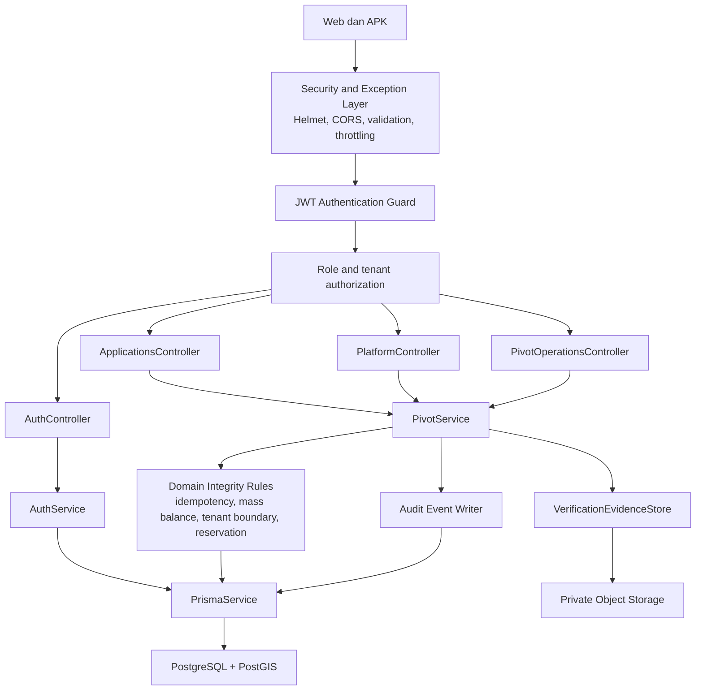
```mermaid
flowchart TB
    Client["Web dan APK"] --> Filter["Security and Exception Layer<br/>Helmet, CORS, validation, throttling"]
    Filter --> AuthGuard["JWT Authentication Guard"]
    AuthGuard --> RolesGuard["Role and tenant authorization"]

    RolesGuard --> AuthController["AuthController"]
    RolesGuard --> ApplicationsController["ApplicationsController"]
    RolesGuard --> PlatformController["PlatformController"]
    RolesGuard --> PivotController["PivotOperationsController"]

    AuthController --> AuthService["AuthService"]
    ApplicationsController --> PivotService["PivotService"]
    PlatformController --> PivotService
    PivotController --> PivotService

    PivotService --> Integrity["Domain Integrity Rules<br/>idempotency, mass balance, tenant boundary, reservation"]
    PivotService --> Audit["Audit Event Writer"]
    PivotService --> Evidence["VerificationEvidenceStore"]
    AuthService --> Prisma["PrismaService"]
    Integrity --> Prisma
    Audit --> Prisma
    Evidence --> PrivateStore["Private Object Storage"]
    Prisma --> Postgres["PostgreSQL + PostGIS"]
```

## 5. Deployment Production

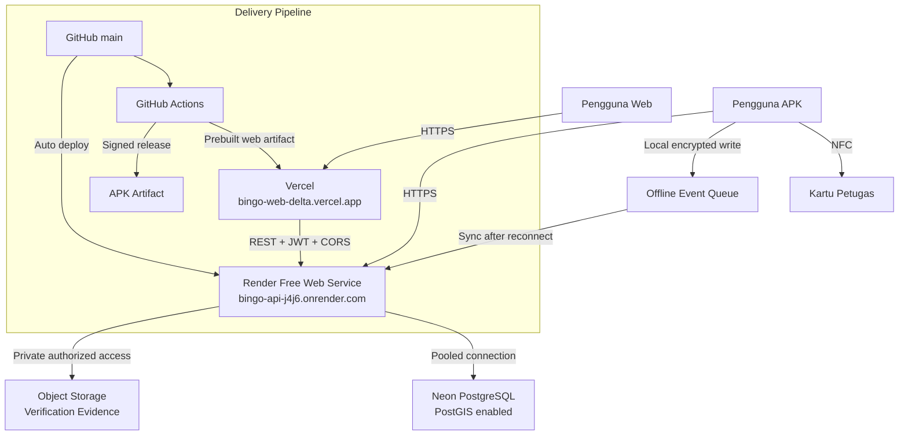
```mermaid
flowchart TB
    UserWeb["Pengguna Web"] -->|HTTPS| Vercel["Vercel<br/>bingo-web-delta.vercel.app"]
    UserAndroid["Pengguna APK"] -->|HTTPS| Render["Render Free Web Service<br/>bingo-api-j4j6.onrender.com"]
    Vercel -->|REST + JWT + CORS| Render
    Render -->|Pooled connection| Neon["Neon PostgreSQL<br/>PostGIS enabled"]
    Render -->|Private authorized access| Blob["Object Storage<br/>Verification Evidence"]
    UserAndroid -->|NFC| Card["Kartu Petugas"]
    UserAndroid -->|Local encrypted write| Queue["Offline Event Queue"]
    Queue -->|Sync after reconnect| Render

    subgraph Delivery["Delivery Pipeline"]
        GitHub["GitHub main"] --> Actions["GitHub Actions"]
        GitHub -->|Auto deploy| Render
        Actions -->|Prebuilt web artifact| Vercel
        Actions -->|Signed release| APK["APK Artifact"]
    end
```

## 6. Model Kewenangan dan Multi-tenancy

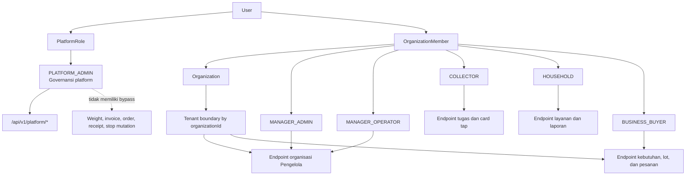
```mermaid
flowchart TB
    User["User"] --> PlatformRole["PlatformRole"]
    User --> Membership["OrganizationMember"]
    Membership --> Organization["Organization"]

    PlatformRole --> Admin["PLATFORM_ADMIN<br/>Governansi platform"]

    Membership --> ManagerAdmin["MANAGER_ADMIN"]
    Membership --> ManagerOperator["MANAGER_OPERATOR"]
    Membership --> Collector["COLLECTOR"]
    Membership --> Household["HOUSEHOLD"]
    Membership --> Buyer["BUSINESS_BUYER"]

    Admin --> PlatformEndpoints["/api/v1/platform/*"]
    ManagerAdmin --> TenantEndpoints["Endpoint organisasi Pengelola"]
    ManagerOperator --> TenantEndpoints
    Collector --> CollectorEndpoints["Endpoint tugas dan card tap"]
    Household --> HouseholdEndpoints["Endpoint layanan dan laporan"]
    Buyer --> BusinessEndpoints["Endpoint kebutuhan, lot, dan pesanan"]

    Organization --> TenantBoundary["Tenant boundary by organizationId"]
    TenantBoundary --> TenantEndpoints
    TenantBoundary --> BusinessEndpoints

    Admin -. tidak memiliki bypass .-> ForbiddenMutation["Weight, invoice, order, receipt, stop mutation"]
```

## 7. Entity Relationship Domain Pivot

Diagram difokuskan pada entitas MVP pivot. Entitas domain legacy tidak ditampilkan.

```mermaid
erDiagram
    USER ||--o{ PLATFORM_ROLE : has
    USER ||--o{ ORGANIZATION_MEMBER : joins
    ORGANIZATION ||--o{ ORGANIZATION_MEMBER : contains
    USER ||--o| ORGANIZATION_APPLICATION : submits
    ORGANIZATION_APPLICATION ||--o{ VERIFICATION_DOCUMENT : attaches
    ORGANIZATION_APPLICATION ||--o{ ORGANIZATION_REVIEW_EVENT : receives

    ORGANIZATION ||--o{ SERVICE_AREA : manages
    SERVICE_AREA ||--o{ HOUSEHOLD : covers
    SERVICE_AREA ||--o{ SERVICE_PLAN : offers
    HOUSEHOLD ||--o{ SUBSCRIPTION : subscribes
    SERVICE_PLAN ||--o{ SUBSCRIPTION : selected_by
    SUBSCRIPTION ||--o{ INVOICE : generates
    INVOICE ||--o{ PAYMENT_EVENT : receives

    ORGANIZATION ||--o{ COLLECTOR : employs
    COLLECTOR ||--o{ COLLECTOR_CARD : owns
    ORGANIZATION ||--o{ COLLECTION_VEHICLE : owns
    SERVICE_AREA ||--o{ COLLECTION_ROUTE : contains
    COLLECTION_ROUTE ||--o{ ROUTE_STOP : contains
    COLLECTION_ROUTE ||--o{ COLLECTION_RUN : instantiates
    COLLECTION_RUN ||--o{ ROUTE_ASSIGNMENT : assigns
    COLLECTOR ||--o{ ROUTE_ASSIGNMENT : receives

    ORGANIZATION ||--o{ WEIGH_STATION : operates
    WEIGH_STATION ||--o{ SCALE_CHANNEL : provides
    ORGANIZATION ||--o{ INTAKE_BATCH : receives
    INTAKE_BATCH ||--o{ WEIGHT_EVENT : records
    INTAKE_BATCH ||--o| SORTING_BATCH : produces
    ORGANIZATION ||--o{ MATERIAL_INVENTORY_LEDGER : owns

    ORGANIZATION ||--o{ BUSINESS_REQUIREMENT : publishes
    BUSINESS_REQUIREMENT ||--o{ MATERIAL_QUALITY_SPEC : defines
    ORGANIZATION ||--o{ MATERIAL_LOT : publishes
    MATERIAL_LOT ||--o{ PURCHASE_ORDER : reserved_by
    PURCHASE_ORDER ||--o| MATERIAL_RECEIPT : closes_with
    PURCHASE_ORDER ||--o| ORDER_SETTLEMENT : settles
    MATERIAL_RECEIPT ||--o{ RESIDUE_TRANSFER : leaves

    ORGANIZATION ||--o{ FACILITY : operates
    FACILITY ||--o{ FACILITY_MATERIAL_RULE : accepts
    FACILITY ||--o{ FACILITY_VERIFICATION : verified_by
    USER ||--o{ WASTE_REPORT : reports
    WASTE_REPORT ||--o{ WASTE_REPORT_EVENT : tracks
    USER ||--o{ AUDIT_EVENT : performs
```

## 8. Golden Path Ujung ke Ujung

```mermaid
flowchart LR
    A["Organisasi mendaftar"] --> B["Admin memverifikasi"]
    B --> C["Pengelola mengaktifkan wilayah dan layanan"]
    C --> D["Warga berlangganan dan membayar"]
    D --> E["Pengelola membuat rute dan tugas"]
    E --> F["Petugas menjalankan pengumpulan"]
    F --> G["Kartu ditap dan material ditimbang"]
    G --> H{"Neraca massa valid?"}
    H -- Tidak --> I["Koreksi dengan event baru"]
    I --> G
    H -- Ya --> J["Inventory ledger bertambah"]
    J --> K["Pengelola menerbitkan lot"]
    K --> L["Business memesan"]
    L --> M["Business mengonfirmasi penerimaan"]
    M --> N["Diversion terverifikasi bertambah"]
    N --> O["Admin melihat audit tanpa mengubah transaksi"]
```

## 9. Sequence Registrasi dan Verifikasi Organisasi

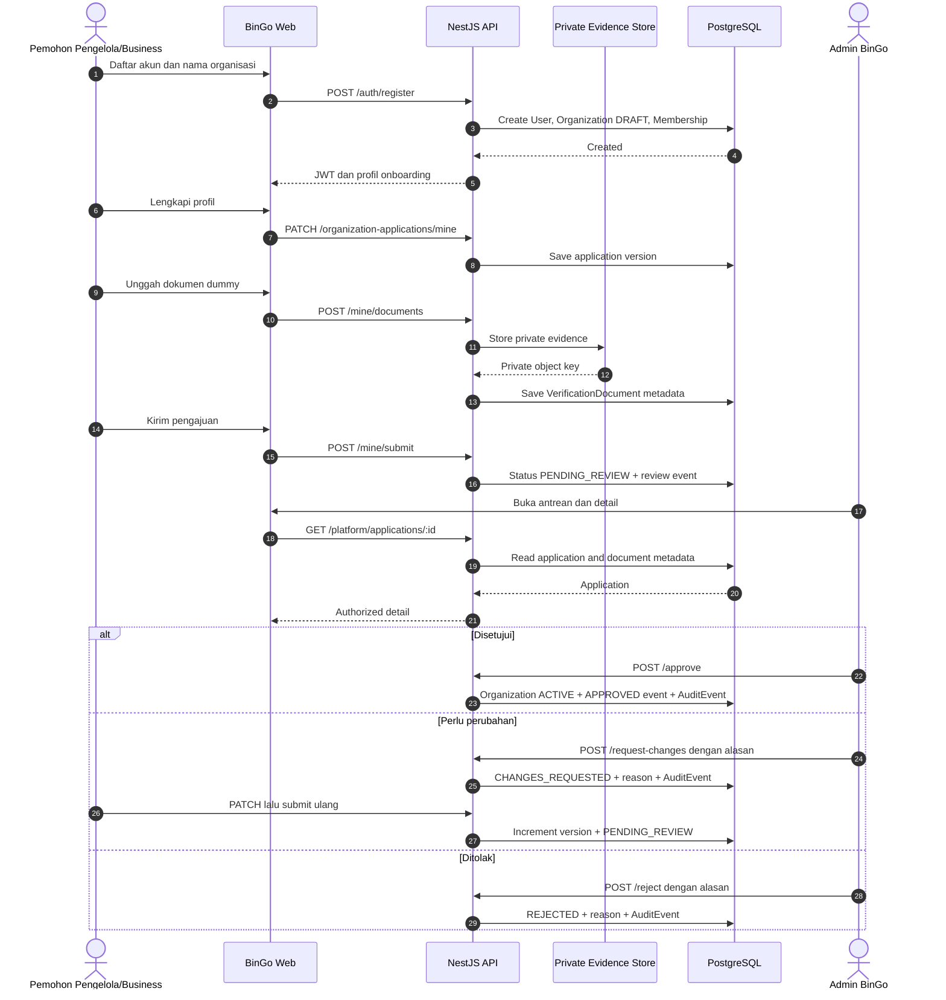
```mermaid
sequenceDiagram
    autonumber
    actor Applicant as Pemohon Pengelola/Business
    participant UI as BinGo Web
    participant API as NestJS API
    participant Store as Private Evidence Store
    participant DB as PostgreSQL
    actor Admin as Admin BinGo

    Applicant->>UI: Daftar akun dan nama organisasi
    UI->>API: POST /auth/register
    API->>DB: Create User, Organization DRAFT, Membership
    DB-->>API: Created
    API-->>UI: JWT dan profil onboarding

    Applicant->>UI: Lengkapi profil
    UI->>API: PATCH /organization-applications/mine
    API->>DB: Save application version

    Applicant->>UI: Unggah dokumen dummy
    UI->>API: POST /mine/documents
    API->>Store: Store private evidence
    Store-->>API: Private object key
    API->>DB: Save VerificationDocument metadata

    Applicant->>UI: Kirim pengajuan
    UI->>API: POST /mine/submit
    API->>DB: Status PENDING_REVIEW + review event

    Admin->>UI: Buka antrean dan detail
    UI->>API: GET /platform/applications/:id
    API->>DB: Read application and document metadata
    DB-->>API: Application
    API-->>UI: Authorized detail

    alt Disetujui
        Admin->>API: POST /approve
        API->>DB: Organization ACTIVE + APPROVED event + AuditEvent
    else Perlu perubahan
        Admin->>API: POST /request-changes dengan alasan
        API->>DB: CHANGES_REQUESTED + reason + AuditEvent
        Applicant->>API: PATCH lalu submit ulang
        API->>DB: Increment version + PENDING_REVIEW
    else Ditolak
        Admin->>API: POST /reject dengan alasan
        API->>DB: REJECTED + reason + AuditEvent
    end
```

## 10. Sequence Layanan Warga dan Pembayaran

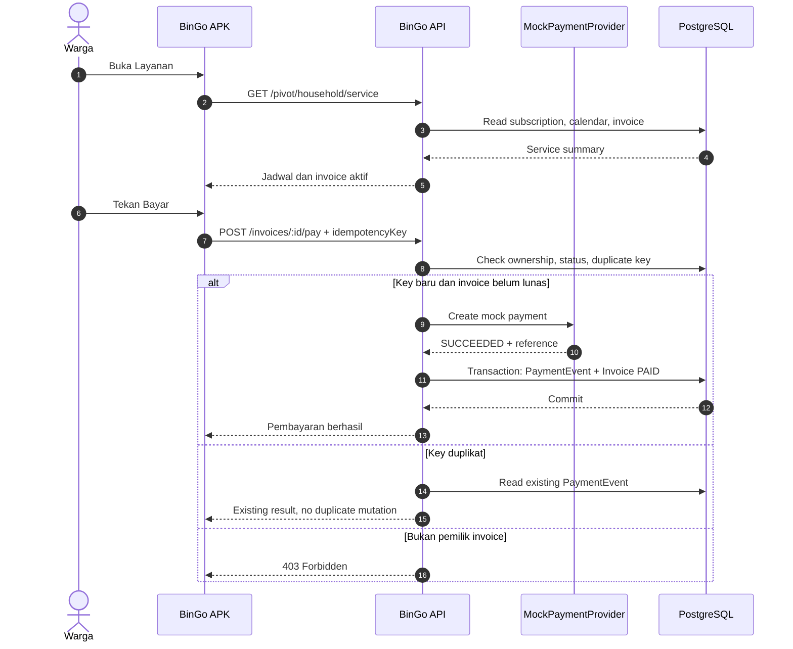
```mermaid
sequenceDiagram
    autonumber
    actor Warga
    participant APK as BinGo APK
    participant API as BinGo API
    participant Provider as MockPaymentProvider
    participant DB as PostgreSQL

    Warga->>APK: Buka Layanan
    APK->>API: GET /pivot/household/service
    API->>DB: Read subscription, calendar, invoice
    DB-->>API: Service summary
    API-->>APK: Jadwal dan invoice aktif

    Warga->>APK: Tekan Bayar
    APK->>API: POST /invoices/:id/pay + idempotencyKey
    API->>DB: Check ownership, status, duplicate key

    alt Key baru dan invoice belum lunas
        API->>Provider: Create mock payment
        Provider-->>API: SUCCEEDED + reference
        API->>DB: Transaction: PaymentEvent + Invoice PAID
        DB-->>API: Commit
        API-->>APK: Pembayaran berhasil
    else Key duplikat
        API->>DB: Read existing PaymentEvent
        API-->>APK: Existing result, no duplicate mutation
    else Bukan pemilik invoice
        API-->>APK: 403 Forbidden
    end
```

## 11. Sequence Rute Pengumpulan

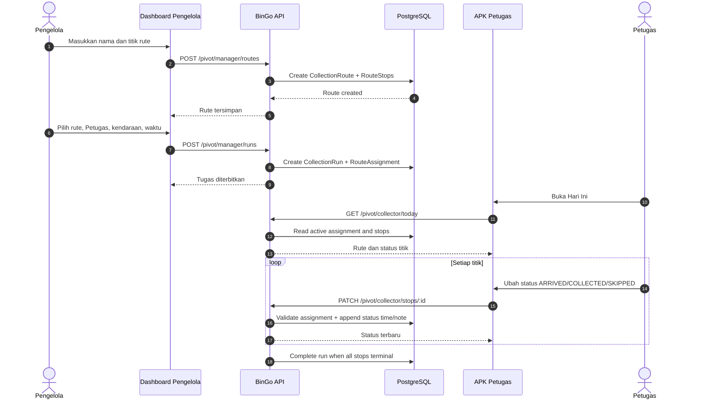
```mermaid
sequenceDiagram
    autonumber
    actor Manager as Pengelola
    participant Web as Dashboard Pengelola
    participant API as BinGo API
    participant DB as PostgreSQL
    participant APK as APK Petugas
    actor Collector as Petugas

    Manager->>Web: Masukkan nama dan titik rute
    Web->>API: POST /pivot/manager/routes
    API->>DB: Create CollectionRoute + RouteStops
    DB-->>API: Route created
    API-->>Web: Rute tersimpan

    Manager->>Web: Pilih rute, Petugas, kendaraan, waktu
    Web->>API: POST /pivot/manager/runs
    API->>DB: Create CollectionRun + RouteAssignment
    API-->>Web: Tugas diterbitkan

    Collector->>APK: Buka Hari Ini
    APK->>API: GET /pivot/collector/today
    API->>DB: Read active assignment and stops
    API-->>APK: Rute dan status titik

    loop Setiap titik
        Collector->>APK: Ubah status ARRIVED/COLLECTED/SKIPPED
        APK->>API: PATCH /pivot/collector/stops/:id
        API->>DB: Validate assignment + append status time/note
        API-->>APK: Status terbaru
    end

    API->>DB: Complete run when all stops terminal
```

## 12. Sequence NFC dan Sinkronisasi Offline

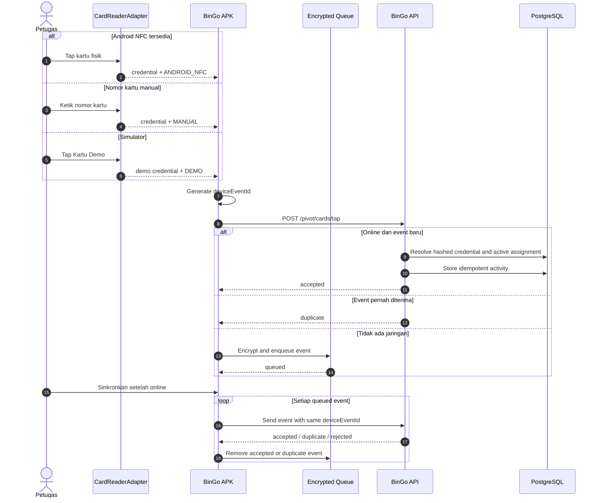
```mermaid
sequenceDiagram
    autonumber
    actor Collector as Petugas
    participant Reader as CardReaderAdapter
    participant APK as BinGo APK
    participant Queue as Encrypted Queue
    participant API as BinGo API
    participant DB as PostgreSQL

    alt Android NFC tersedia
        Collector->>Reader: Tap kartu fisik
        Reader-->>APK: credential + ANDROID_NFC
    else Nomor kartu manual
        Collector->>Reader: Ketik nomor kartu
        Reader-->>APK: credential + MANUAL
    else Simulator
        Collector->>Reader: Tap Kartu Demo
        Reader-->>APK: demo credential + DEMO
    end

    APK->>APK: Generate deviceEventId
    APK->>API: POST /pivot/cards/tap

    alt Online dan event baru
        API->>DB: Resolve hashed credential and active assignment
        API->>DB: Store idempotent activity
        API-->>APK: accepted
    else Event pernah diterima
        API-->>APK: duplicate
    else Tidak ada jaringan
        APK->>Queue: Encrypt and enqueue event
        Queue-->>APK: queued
    end

    Collector->>APK: Sinkronkan setelah online
    loop Setiap queued event
        APK->>API: Send event with same deviceEventId
        API-->>APK: accepted / duplicate / rejected
        APK->>Queue: Remove accepted or duplicate event
    end
```

## 13. Sequence Penimbangan, Pemilahan, dan Inventory

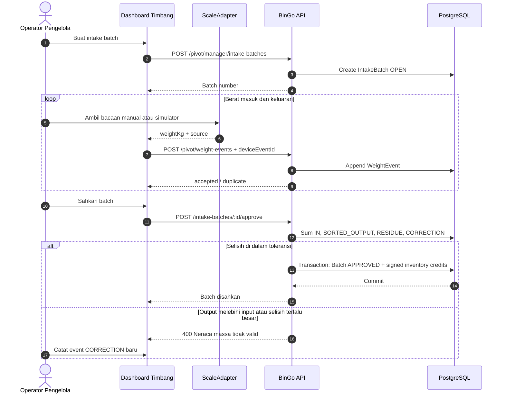
```mermaid
sequenceDiagram
    autonumber
    actor Operator as Operator Pengelola
    participant UI as Dashboard Timbang
    participant Scale as ScaleAdapter
    participant API as BinGo API
    participant DB as PostgreSQL

    Operator->>UI: Buat intake batch
    UI->>API: POST /pivot/manager/intake-batches
    API->>DB: Create IntakeBatch OPEN
    API-->>UI: Batch number

    loop Berat masuk dan keluaran
        Operator->>Scale: Ambil bacaan manual atau simulator
        Scale-->>UI: weightKg + source
        UI->>API: POST /pivot/weight-events + deviceEventId
        API->>DB: Append WeightEvent
        API-->>UI: accepted / duplicate
    end

    Operator->>UI: Sahkan batch
    UI->>API: POST /intake-batches/:id/approve
    API->>DB: Sum IN, SORTED_OUTPUT, RESIDUE, CORRECTION

    alt Selisih di dalam toleransi
        API->>DB: Transaction: Batch APPROVED + signed inventory credits
        DB-->>API: Commit
        API-->>UI: Batch disahkan
    else Output melebihi input atau selisih terlalu besar
        API-->>UI: 400 Neraca massa tidak valid
        Operator->>UI: Catat event CORRECTION baru
    end
```

## 14. Sequence Marketplace Material

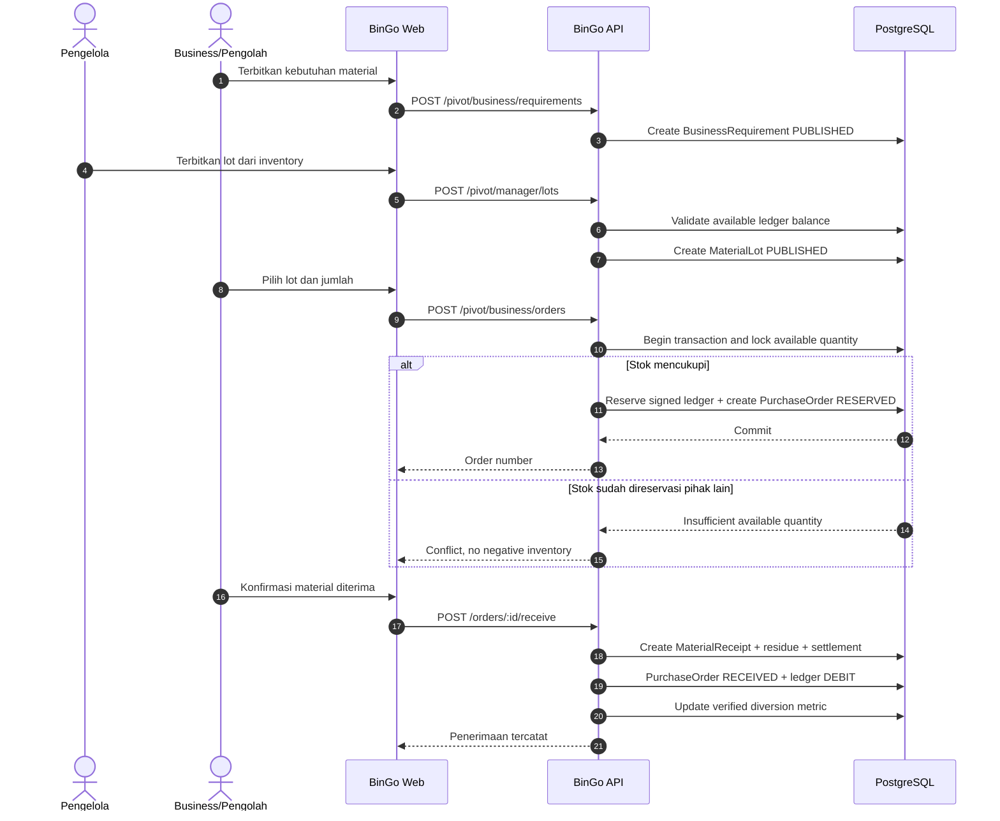
```mermaid
sequenceDiagram
    autonumber
    actor Manager as Pengelola
    actor Buyer as Business/Pengolah
    participant Web as BinGo Web
    participant API as BinGo API
    participant DB as PostgreSQL

    Buyer->>Web: Terbitkan kebutuhan material
    Web->>API: POST /pivot/business/requirements
    API->>DB: Create BusinessRequirement PUBLISHED

    Manager->>Web: Terbitkan lot dari inventory
    Web->>API: POST /pivot/manager/lots
    API->>DB: Validate available ledger balance
    API->>DB: Create MaterialLot PUBLISHED

    Buyer->>Web: Pilih lot dan jumlah
    Web->>API: POST /pivot/business/orders
    API->>DB: Begin transaction and lock available quantity

    alt Stok mencukupi
        API->>DB: Reserve signed ledger + create PurchaseOrder RESERVED
        DB-->>API: Commit
        API-->>Web: Order number
    else Stok sudah direservasi pihak lain
        DB-->>API: Insufficient available quantity
        API-->>Web: Conflict, no negative inventory
    end

    Buyer->>Web: Konfirmasi material diterima
    Web->>API: POST /orders/:id/receive
    API->>DB: Create MaterialReceipt + residue + settlement
    API->>DB: PurchaseOrder RECEIVED + ledger DEBIT
    API->>DB: Update verified diversion metric
    API-->>Web: Penerimaan tercatat
```

## 15. Sequence Pelaporan Sampah Liar

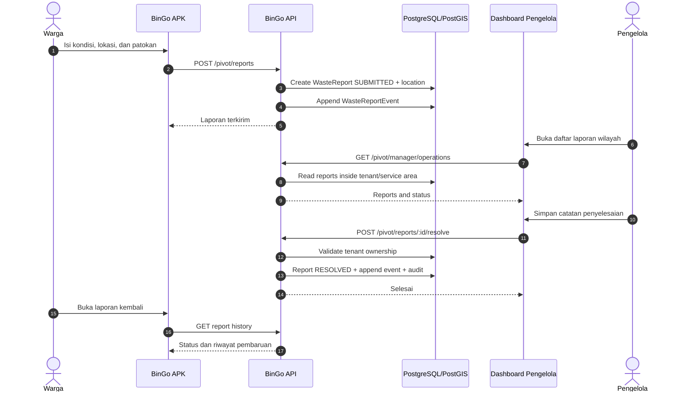
```mermaid
sequenceDiagram
    autonumber
    actor Warga
    participant APK as BinGo APK
    participant API as BinGo API
    participant DB as PostgreSQL/PostGIS
    participant Web as Dashboard Pengelola
    actor Manager as Pengelola

    Warga->>APK: Isi kondisi, lokasi, dan patokan
    APK->>API: POST /pivot/reports
    API->>DB: Create WasteReport SUBMITTED + location
    API->>DB: Append WasteReportEvent
    API-->>APK: Laporan terkirim

    Manager->>Web: Buka daftar laporan wilayah
    Web->>API: GET /pivot/manager/operations
    API->>DB: Read reports inside tenant/service area
    API-->>Web: Reports and status

    Manager->>Web: Simpan catatan penyelesaian
    Web->>API: POST /pivot/reports/:id/resolve
    API->>DB: Validate tenant ownership
    API->>DB: Report RESOLVED + append event + audit
    API-->>Web: Selesai

    Warga->>APK: Buka laporan kembali
    APK->>API: GET report history
    API-->>APK: Status dan riwayat pembaruan
```

## 16. State Organisasi

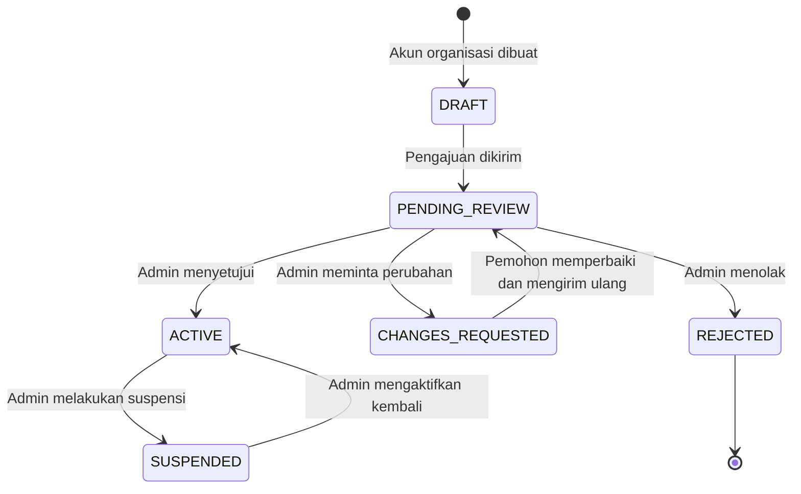
```mermaid
stateDiagram-v2
    [*] --> DRAFT: Akun organisasi dibuat
    DRAFT --> PENDING_REVIEW: Pengajuan dikirim
    PENDING_REVIEW --> ACTIVE: Admin menyetujui
    PENDING_REVIEW --> CHANGES_REQUESTED: Admin meminta perubahan
    PENDING_REVIEW --> REJECTED: Admin menolak
    CHANGES_REQUESTED --> PENDING_REVIEW: Pemohon memperbaiki dan mengirim ulang
    ACTIVE --> SUSPENDED: Admin melakukan suspensi
    SUSPENDED --> ACTIVE: Admin mengaktifkan kembali
    REJECTED --> [*]
```

## 17. State Collection Run dan Route Stop

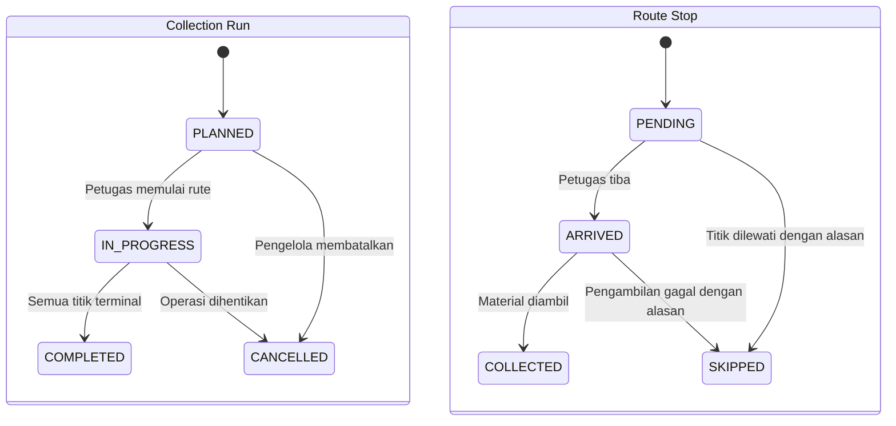
```mermaid
stateDiagram-v2
    state "Collection Run" as Run {
        [*] --> PLANNED
        PLANNED --> IN_PROGRESS: Petugas memulai rute
        IN_PROGRESS --> COMPLETED: Semua titik terminal
        PLANNED --> CANCELLED: Pengelola membatalkan
        IN_PROGRESS --> CANCELLED: Operasi dihentikan
    }

    state "Route Stop" as Stop {
        [*] --> PENDING
        PENDING --> ARRIVED: Petugas tiba
        ARRIVED --> COLLECTED: Material diambil
        PENDING --> SKIPPED: Titik dilewati dengan alasan
        ARRIVED --> SKIPPED: Pengambilan gagal dengan alasan
    }
```

## 18. State Batch Timbang

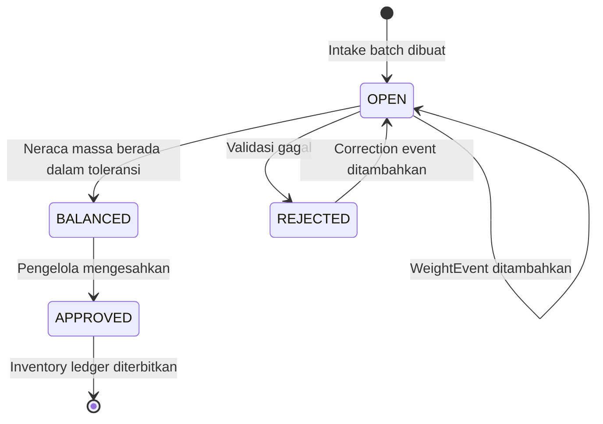
```mermaid
stateDiagram-v2
    [*] --> OPEN: Intake batch dibuat
    OPEN --> OPEN: WeightEvent ditambahkan
    OPEN --> BALANCED: Neraca massa berada dalam toleransi
    OPEN --> REJECTED: Validasi gagal
    REJECTED --> OPEN: Correction event ditambahkan
    BALANCED --> APPROVED: Pengelola mengesahkan
    APPROVED --> [*]: Inventory ledger diterbitkan
```

Catatan: koreksi berat tidak mengubah event lama. Sistem menambahkan `WeightEvent` baru dengan arah `CORRECTION` agar histori tetap append-only.

## 19. State Lot dan Pesanan

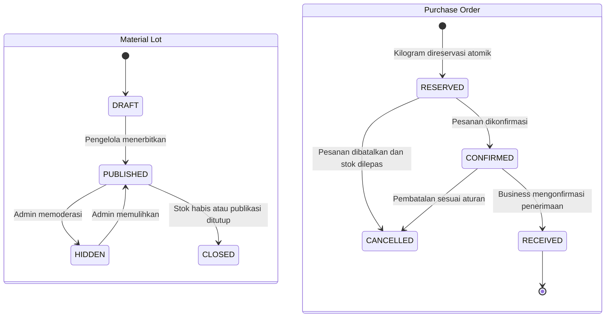
```mermaid
stateDiagram-v2
    state "Material Lot" as Lot {
        [*] --> DRAFT
        DRAFT --> PUBLISHED: Pengelola menerbitkan
        PUBLISHED --> HIDDEN: Admin memoderasi
        HIDDEN --> PUBLISHED: Admin memulihkan
        PUBLISHED --> CLOSED: Stok habis atau publikasi ditutup
    }

    state "Purchase Order" as Order {
        [*] --> RESERVED: Kilogram direservasi atomik
        RESERVED --> CONFIRMED: Pesanan dikonfirmasi
        RESERVED --> CANCELLED: Pesanan dibatalkan dan stok dilepas
        CONFIRMED --> RECEIVED: Business mengonfirmasi penerimaan
        CONFIRMED --> CANCELLED: Pembatalan sesuai aturan
        RECEIVED --> [*]
    }
```

## 20. Data Flow Dampak Terverifikasi

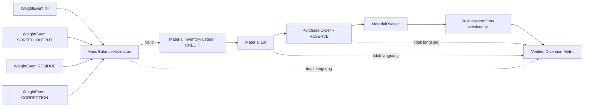
```mermaid
flowchart LR
    Intake["WeightEvent IN"] --> Balance["Mass Balance Validation"]
    Sorted["WeightEvent SORTED_OUTPUT"] --> Balance
    Residue["WeightEvent RESIDUE"] --> Balance
    Correction["WeightEvent CORRECTION"] --> Balance

    Balance -->|Valid| Ledger["Material Inventory Ledger CREDIT"]
    Ledger --> Lot["Material Lot"]
    Lot --> Reserve["Purchase Order + RESERVE"]
    Reserve --> Receipt["MaterialReceipt"]
    Receipt --> Received["Business confirms receivedKg"]
    Received --> Diversion["Verified Diversion Metric"]

    Balance -. tidak langsung .-> Diversion
    Lot -. tidak langsung .-> Diversion
    Reserve -. tidak langsung .-> Diversion
```

Diversion baru bertambah setelah Business mengonfirmasi penerimaan. Pembuatan batch, lot, atau pesanan belum cukup untuk diklaim sebagai material yang benar-benar dialihkan dari landfill.

## 21. CI/CD dan Quality Gate

```mermaid
flowchart TB
    Change["Push atau Pull Request"] --> Shared["Build shared packages"]
    Shared --> Prisma["Prisma format, validate, generate"]
    Prisma --> Lint["Lint workspaces"]
    Lint --> BackendBuild["Backend build"]
    BackendBuild --> Unit["Backend unit tests"]
    Unit --> E2E["Backend E2E with PostgreSQL/PostGIS"]
    E2E --> MobileType["Expo typecheck"]
    MobileType --> MobileTest["Expo tests"]
    MobileTest --> WebExport["Expo web export with clean cache"]
    WebExport --> BundleCheck{"Bundle API URL valid?<br/>No import.meta?<br/>HTTPS public origin?"}

    BundleCheck -- Tidak --> Failed["Pipeline failed"]
    BundleCheck -- Ya --> WebDeploy["Deploy prebuilt artifact to Vercel"]
    WebDeploy --> WebSmoke["Smoke /login, SPA reload, JS content type"]

    Change --> RenderDeploy["Render auto deploy backend"]
    RenderDeploy --> Health["Verify /health, DB, PostGIS, commit"]

    Change -->|Release tag or dispatch| APKBuild["Build signed APK"]
    APKBuild --> Signature["Verify APK signature"]
    Signature --> Artifact["Publish APK artifact"]
```

## Pedoman Pemakaian

- Proposal kompetisi sebaiknya memakai Diagram 1, 2, 8, 13, dan 20.
- Dokumen teknis sebaiknya memakai seluruh diagram C4, deployment, ER, sequence, state, dan CI/CD.
- Video demo dapat mengikuti urutan pada Diagram 8.
- Pengujian manual dapat memetakan setiap langkah Diagram 8 ke `FUNCTIONAL-TESTING-MVP-5-ROLE.md`.
- Jika domain atau endpoint berubah, perbarui diagram dan functional testing dalam commit yang sama.

## Sumber Implementasi

- `apps/mobile/app`: route dan pengalaman lima role.
- `apps/mobile/src/components`: design system, auth layout, dashboard shell, dan dialog.
- `apps/mobile/src/features/pivot`: hooks, adaptor, API client, serta offline queue.
- `apps/backend/src/modules/pivot`: endpoint dan aturan domain pivot.
- `apps/backend/prisma/schema.prisma`: entitas, enum, dan relasi database.
- `render.yaml`: deployment backend Render.
- `.github/workflows`: CI/CD web, backend, dan APK.
- `docs/FUNCTIONAL-TESTING-MVP-5-ROLE.md`: acceptance flow manual.
